## Emerson Shigueo Sugimoto 😎

  
  <!--
  -->
  

##

  
  
  
  
  
  
  
  
  
  
  
  
  
  
  
  
  
  
  
  
  
  
  
  
  
  
  
  
  
  
  
  
  
  

##

  
  
  
  
  

##

  
  

<!--
https://raw.githubusercontent.com
https://github.com/Ileriayo/markdown-badges
https://www.youtube.com/watch?v=U-IVndCqXWc
-->
